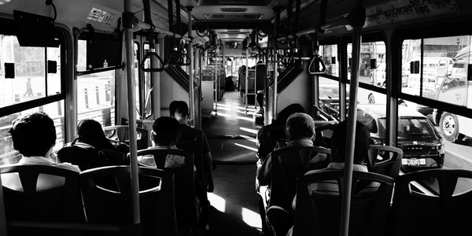

<!DOCTYPE html>
<html lang="en" dir="ltr">
  <head>
    <meta charset="utf-8">
    <title >our lives matter!</title>
    <link rel="stylesheet" href="project2.css">
  </head>
  <body class="body1">

  <h1 class="head">   <a href="#1our" > our </a> <a href="#2lives"> lives </a> <a href="#3matters"> matter </a> </h1>
<figure >
  <section class="sec1">
    
    
<a id=1our>Stand against racism

    
Make everyplace safe

    </section>

    <section class="sec2">

      
      <h4 class="head3"><a id=2lives>Discrimination shouldn’t be allowed anywhere.I faced discrimination.Those who discriminated people they are definitely racist.One day I was going to bus station from my work.suddenly a guy came and slapped on my ear that time I got totally shocked.I never aspect that could be happed.That time I also new in this country.I didn’t know how to call the police that time.I called people they didn’t do nothing for me.I cried that day.I don’t know why he did that with me.may be I am not looking good but I am as a human being,I also deserve respect.

</h4>
  </section>

      <section class="sec3">
      
    
<a id="3matters">I don’t know why some people do that.I literally hate that.It shouldn’t be happened with any person.It will attack on their mind badly.We are all should aware of that kind of discrimination.We should raise our voice against that.May be one day world will be peaceful place for every color and every culture people.

  </section>
<section section="sec4" >
  
  
<a href="https://www.npr.org/sections/live-updates-protests-for-racial-justice">our lives matter</a>

</section>

</figure>

<footer class="footer">Project2 @Md.shajed 28 march,2022</footer>
  </body>
</html>
